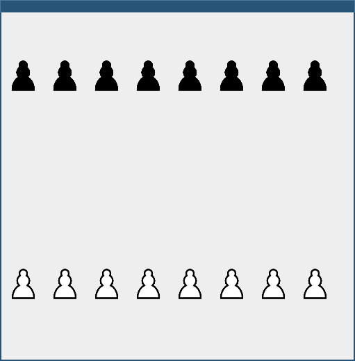
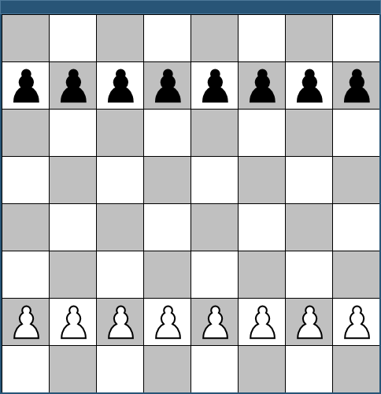

# Hintergrund

Nachdem Sie in der letzten Übung ein grundlegendes Schachbrett mit Bauern unter Verwendung von Standard-Komponenten implementiert haben, bauen Sie das Ganze nun nach, indem Sie in einem `JPanel` die Methode `paintComponent()` überschreiben. Keine Sorge - das hört sich kompliziert an, ist aber am Ende deutlich simpler, als die Verwendung der Standard-Komponenten.

Da es sich hier um eine recht komplexe Übungsaufgabe handelt, finden Sie - falls etwas nicht verständlich ist und Sie selber nachschauen wollen - im Branch [Solutions](https://github.com/dabrowskiw/ChessGameJLabels/tree/solutions) in diesem git-repository eine Beispiellösung für die vollständige Aufgabe.

## DrawGamePanel

Die gesamte Magie passiert nun in einer Klasse `DrawGamePanel`, die von `GamePanel` ableitet und das Interface `MouseMotionListener` implementiert (implementieren Sie hier zunächst alle geforderten Methoden ohne Logik, also einfach leere Methoden).

Implementieren Sie diese Klasse im package `chess.ui` mit den folgenden Attributen und Methoden:

### Attribute

* `private Color highlightColor = new Color(125, 125, 255)`: Die Farbe zum Hervorheben von Schachfeldern, hier schlage ich als Standardwert ein helles Blau vor.
* `private Color darkColor = Color.LIGHT_GRAY`: Die Farbe für die schwarzen Schachfelder, hier schlage ich als Standardwert ein helles Grau vor.
* `private Color lightColor = Color.WHITE`: Die Farbe für die weißen Schachfelder, hier schlage ich Weiß vor.
* `private ChessBoard board`: Das `ChessBoard`-Objekt, welches das Schachbrett repräsentiert.
* `private int fieldSize = 60`: Die Breite/Höhe eines Schachfeldes in Pixeln.

### Methoden

* `public DrawGamePanel(int fieldSize)`: Ruft den `super`-Constructor auf, initialisiert ein neues `ChessBoard` und fügt sich sich selber als `MouseMotionListener` hinzu. Sie sollten hier außerdem die Maße, welche dieses GUI-Element im Layout einnimmt, setzen, z.B. durch: `setPreferredSize(new Dimension(fieldSize*8, fieldSize*8));`
* `public void paintComponent(Graphics g)`: Die eigentliche Darstellung. Beginnen Sie hier, indem Sie mit der Methode `drawImage(Image i, int x, int y, ImageObserver observer)` für jedes `ChessPiece` das `Image` des aktuellen Icons zeichnen. Als `ImageObserver` können Sie einfach `null` übergeben. 

Bereits nun sollten Sie, wenn Sie in Ihrer `Main`-Klasse das `DrawGamePanel` verwenden, die folgende Darstellung sehen:



Eine beispielhafte Verwendung in `MainWindow` könnte hierfür sein:

```java
package chess;

import chess.ui.DrawGamePanel;
import javax.swing.*;

public class MainWindow extends JFrame {
  public MainWindow() {
    setDefaultCloseOperation(JFrame.EXIT_ON_CLOSE);
    add(new DrawGamePanel(60));
    pack();
  }

  static void main() {
    new MainWindow().setVisible(true);
  }
}
```

Implementieren Sie num zusätzlich die folgende Methode:

`public void paintBoard(Graphics2D g2d)`: Stellt das Schachbrett dar, indem die Trennlinien zwischen den Schachfeldern mit `drawLine()` gezeichnet sowie die Felder entsprechend ihrer Farbe mit `fillRect()` ausgefüllt werden.

Rufen Sie nun die neu implementierte Methode `paintBoard()` auch in `paintComponent()` auf. Sie müssten nun schon die folgende Darstellung sehen:



Implementieren Sie nun die folgenden 3 Hilfs-Methoden, bevor Sie sich um die Interaktivität kümmern:

* `public void updateGUI()`: Ruft einfach `repaint()` auf, um zu signalisieren, dass der Inhalt sich geändert hat und das ganze Fenster neu gezeichnet werden muss.
* `private boolean overPiece(Point point, ChessPiece piece)`: Überprüft anhand der Koordinaten innerhalb von `java.awt.Point`, ob der Punkt sich über dem `ChessPiece` befindet. `java.awt.Point` enthält die Attribute `x` und `y`, die die Koordinaten der Maus in Pixeln relativ zur aktuellen Komponente enthalten - x=0 und y=0 entspricht der oberen linken Ecke der Komponente, y steigt wenn die Maus weiter nach unten verschoben wird und x steigt bei Verschiebung nach rechts.
* `private void highlightMovableFields(ChessPiece p)`: Markiert die Felder des `ChessBoard`, zu denen das übergebene `ChessPiece` sich bewegen kann, als "highlighted" (Sie haben dafür letzte Woche die Methoden `ChessBoard.highlight(int x, int y)` sowie `ChessPiece.canMoveTo(int x, int y)` implementiert).

Implementieren Sie nun die Methode `public void mouseMoved(MouseEvent e)` (welche vom Interface `MouseMotionListener` gefordert ist). Diese soll überprüfen, ob die Maus gerade über eine Figur bewegt wurde (Sie bekommen den Punkt, an dem sich die Maus gerade befindet, von einem `MouseEvent e` mit der Methode `e.getPoint()` als `java.awt.Point`-Objekt). Falls ja, soll die Figur sowie alle Felder auf dem Schachbrett, zu denen sie sich bewegen kann, hervorgehoben werden (und das GUI soll aktualisiert werden, damit die Veränderungen zu sehen sind).

Versuchen Sie, die Methode, wenn sie erstmal funktioniert, so effizient wie möglich zu implementieren: Wenn die Maus schon über einer Figur war und weiterhin über der selben Figur ist, muss nicht alles neu berechnet und gezeichnet werden! Genau so auch, wenn die Maus vorher über keiner Figur war und es jetzt immer noch nicht ist. Unnötige Zeichenoperationen und Berechnungen bei jeder Mausbewegung verlangsamen das Programm nur unnötig!